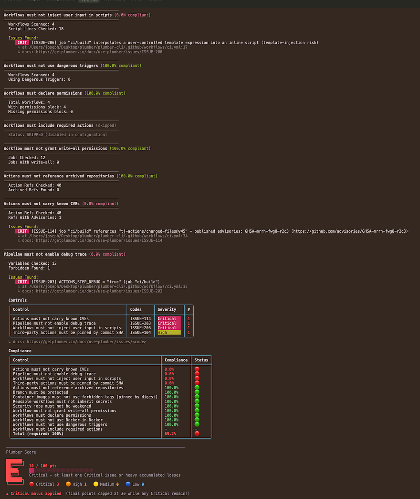

import { Icon } from "astro-icon/components";

Plumber scans your **GitHub Actions** workflows and repository configuration for security problems:

- Unpinned actions
- Untrusted input in shell scripts
- Missing branch protection
- [More…](/docs/use-plumber/controls?p=github)

It turns them into a [Plumber Score](/docs/plumber-score) from <span class="text-primary-400 dark:text-primary-300 font-bold">A</span> to <span class="font-bold text-red-400 dark:text-red-300">E</span> that can block CI below a minimum score you set.

## Quick Start

Two ways to scan a GitHub repository:

<div class="not-content grid gap-6 sm:grid-cols-2 my-8">
  <a href="#run-locally" class="group block rounded-2xl border bg-card text-card-foreground shadow-sm no-underline transition-colors hover:border-primary/50 focus-visible:outline focus-visible:outline-2 focus-visible:outline-offset-2 focus-visible:outline-primary">
    <div class="flex flex-col space-y-2 p-6">
      <div class="text-xl font-semibold tracking-tight text-card-foreground">
        <Icon name="tabler/terminal-2" size="24px" class="inline align-text-bottom mr-1" /> Run locally
      </div>
      <div class="text-muted-foreground text-sm">Scan one repo from your machine: quick checks before you push, security-team audits, or scanning an upstream repo without touching its CI.</div>
      <div class="pt-2 text-primary text-sm font-medium group-hover:underline">Local CLI →</div>
    </div>
  </a>

  <a href="#run-with-github-actions" class="group block rounded-2xl border bg-card text-card-foreground shadow-sm no-underline transition-colors hover:border-primary/50 focus-visible:outline focus-visible:outline-2 focus-visible:outline-offset-2 focus-visible:outline-primary">
    <div class="flex flex-col space-y-2 p-6">
      <div class="text-xl font-semibold tracking-tight text-card-foreground">
        <Icon name="tabler/brand-github" size="24px" class="inline align-text-bottom mr-1" /> Run with GitHub Actions
      </div>
      <div class="text-muted-foreground text-sm">Automated scans on every push or pull request, SARIF in Code Scanning, and a live score badge, with no Plumber install on developer machines.</div>
      <div class="pt-2 text-primary text-sm font-medium group-hover:underline">GitHub Action →</div>
    </div>
  </a>
</div>

## Run locally

Best for trying Plumber on one repo, checks before you push, security-team audits, or scanning upstream repos without changing CI.

<Steps>
1. **Install Plumber**: Homebrew, mise, a prebuilt binary, Docker, or from source (see [Installation](/docs/cli/installation)).

2. **Authenticate**: run `gh auth login`, or set a `GH_TOKEN` with read access to the repo (see [Authentication](#authentication)).

3. **Run the scan** from inside your checked-out repo, or against a remote one (see [Running a scan](#running-a-scan)):

   ```bash
   plumber analyze
   ```

4. **Read your Plumber score**: an A–E grade with a per-control breakdown, plus an optional JSON report, PBOM, and CycloneDX SBOM (see [Example Output](#example-output)).
</Steps>


## Run with GitHub Actions

<Steps>
1. **Add the action to your workflow** (e.g. `.github/workflows/plumber.yml`):

   <Aside variant="tip">

   - **Pin by commit SHA, not a tag.** Copy the ready-to-paste SHA-pinned `uses:` line from the [GitHub Action section of the README](https://github.com/getplumber/plumber#option-3-github-action), auto-updated on new releases.
   - **Permissions.** The job needs `security-events: write` for SARIF upload to Code Scanning; without it that step is skipped. Add `id-token: write` to publish a live score badge.
   - **Publish a live score badge.** Set `score-push: true` to publish a **public** Plumber Score badge for this repo. See [Plumber Score](/docs/plumber-score).

   </Aside>

   ```yaml
   name: Plumber

   on:
     push:
       branches: [main]
     pull_request: null

   permissions:
     contents: read
     security-events: write
     # id-token: write          # uncomment to publish a live Plumber Score badge (see below)

   jobs:
     plumber:
       runs-on: ubuntu-24.04
       steps:
         - uses: actions/checkout@v6
         - uses: getplumber/plumber@530504355206ac91cbf53916814fa13ef123bdda # pinned plumber version: v0.4.42
           with:
             score-push: false # set to "true" to publish a public Plumber Score badge
   ```

2. **Push and check results**: findings appear in the **Code Scanning** tab, the job summary, and the downloadable artifact bundle.

3. **Optionally tune the policy with a `.plumber.yaml`**

   Without one, the action runs Plumber's built-in default policy, so you can stop here. To tune the policy, the recommended way is a small overlay that [extends Plumber's baseline](/docs/cli/reference#configuration) and lists only what you change:

   ```bash
   plumber config generate --overlay
   ```

   ```yaml
   extends: plumber:default
   version: "2.0"

   github:
     controls:
       actionsMustBePinnedByCommitSha:
         trustedOwners:
           - myorg
   ```

   `plumber config generate` (without `--overlay`) writes the full self-contained template instead. See the three configuration modes in the [CLI Reference](/docs/cli/reference#configuration).
</Steps>

### Customizing the action

Override any input to fit your needs:

```yaml
- uses: getplumber/plumber@530504355206ac91cbf53916814fa13ef123bdda # pinned plumber version: v0.4.42
  with:
    min-score: "B"
    config-file: configs/strict.plumber.yaml
    controls: actionsMustBePinnedByCommitSha,branchMustBeProtected
    score: "true"
    soft-fail: "true"
    upload-sarif: "true"
    upload-artifacts: "true"
```

### All inputs

| Input | Default | Description |
|-------|---------|-------------|
| `version` | _(pinned in action.yml)_ | Plumber release tag to install. Downloaded from GitHub Releases and verified against `checksums.txt` |
| `verify-attestation` | `true` | Verify the binary's SLSA build-provenance attestation via `gh attestation verify`. Disable for air-gapped or GHES setups |
| `github-token` | `${{ github.token }}` | Token for the GitHub API and SARIF upload. Needs `Administration:read` for full `branchMustBeProtected`, and `security-events:write` for SARIF |
| `metadata-token` | - | Optional token (public-repo read) used only to resolve third-party action versions for the known-CVE check, when an action is hosted in an org with an IP allow list that blocks the runner's `GITHUB_TOKEN`. Falls back to an anonymous read when unset |
| `project` | _(current repo)_ | `owner/repo` to scan remotely (upstream-fetch, no checkout needed) |
| `github-url` | _(github.com)_ | GitHub Enterprise Server host (e.g. `ghes.example.com`) |
| `min-score` | - | Minimum [Plumber Score](/docs/plumber-score) letter to pass (A-E), e.g. `B` fails on C, D, E. The recommended way to gate CI on the score |
| `min-points` | `100` | Fine-grained gate on score points (0-100). The default (100) fails on any finding; not applied when only `min-score` is set |
| `threshold` | - | **Deprecated.** Minimum percentage of passing controls (0-100). Use `min-score` / `min-points` instead |
| `config-file` | _(auto-detect)_ | Path to a `.plumber.yaml`. Default: the repo's `.plumber.yaml` if present, otherwise the [built-in default config](/docs/cli/reference#no-configuration) (zero-config runs work out of the box) |
| `controls` | - | Run only these controls (comma-separated). Mutually exclusive with `skip-controls` |
| `skip-controls` | - | Skip these controls (comma-separated). Mutually exclusive with `controls` |
| `score` | `true` | Include the full points breakdown. The Plumber score is shown by default; set `false` for the banner without the per-issue-code breakdown |
| `score-push` | `false` | Publish this repo's Plumber Score to the hosted badge service ([score.getplumber.io](https://score.getplumber.io)) via CI-native OIDC (**no secret**). The workflow MUST grant `permissions: id-token: write`. Publishes on every run; the service keeps only the default branch for the public badge. Warns (never fails) on error. See [Plumber Score](/docs/plumber-score) |
| `score-endpoint` | `https://score.getplumber.io` | Score service base URL. Override **only** for a self-hosted score service; the OIDC audience follows this value so it always matches the target |
| `fail-warnings` | `false` | Fail on warnings: unknown configuration keys (exit 2) and "could not verify" checks such as a skipped known-CVE lookup (exit 3). `soft-fail` does not mask exit 3 |
| `soft-fail` | `false` | Do not fail the job when the score is below the gate. Findings are still produced and uploaded |
| `upload-sarif` | `true` | Upload the SARIF report to GitHub Code Scanning |
| `upload-artifacts` | `true` | Upload JSON report, PBOM, and CycloneDX SBOM as a workflow artifact |
| `artifact-name` | `plumber-report` | Name of the uploaded artifact bundle |
| `output` | `plumber-report.json` | JSON report output path. Empty to skip |
| `pbom` | `plumber-pbom.json` | PBOM output path. Empty to skip |
| `pbom-cyclonedx` | `plumber-cyclonedx-sbom.json` | CycloneDX SBOM output path. Empty to skip |
| `sarif` | `plumber.sarif` | SARIF 2.1.0 output path. Empty to skip |

### Outputs

| Output | Description |
|--------|-------------|
| `passed` | `true` when the run met its gate (`min-score` / `min-points`, or the deprecated `threshold`) |
| `report` | Path to the JSON report |
| `sarif` | Path to the SARIF report |

Use outputs in downstream steps:

```yaml
- uses: getplumber/plumber@530504355206ac91cbf53916814fa13ef123bdda # pinned plumber version: v0.4.42
  id: plumber
- run: echo "Plumber check passed: ${{ steps.plumber.outputs.passed }}"
```

### Code Scanning integration

When `upload-sarif` is `true` (the default), the action uploads a SARIF 2.1.0 report to [GitHub Code Scanning](https://docs.github.com/en/code-security/code-scanning). Each Plumber finding becomes an alert in the **Security** tab with:

- The issue code as the rule ID (e.g. `ISSUE-701`)
- Severity mapped to SARIF level (`error`, `warning`, `note`) and a numeric `security-severity` for triage
- File location pointing at the workflow YAML line
- A `helpUri` linking to the issue's documentation page on getplumber.io

<Aside variant="info">
  Code Scanning requires GitHub Advanced Security on private repos. On public repos it is free.
</Aside>

### GitHub Enterprise Server

For GHES, pass the host via `github-url`:

```yaml
- uses: getplumber/plumber@530504355206ac91cbf53916814fa13ef123bdda # pinned plumber version: v0.4.42
  with:
    github-url: ghes.example.com
    verify-attestation: "false"
```

Set `verify-attestation: "false"` if the runner cannot reach the sigstore transparency log or your GHES instance does not support `gh attestation verify`.

### Action examples

**Scan a remote repo without cloning:**

```yaml
- uses: getplumber/plumber@530504355206ac91cbf53916814fa13ef123bdda # pinned plumber version: v0.4.42
  with:
    project: my-org/other-repo
    github-token: ${{ secrets.PLUMBER_PAT }}
```

**Run only SHA-pinning and permissions checks:**

```yaml
- uses: getplumber/plumber@530504355206ac91cbf53916814fa13ef123bdda # pinned plumber version: v0.4.42
  with:
    controls: actionsMustBePinnedByCommitSha,workflowsMustDeclarePermissions
```

**Soft-fail in PRs, hard-fail on main:**

```yaml
- uses: getplumber/plumber@530504355206ac91cbf53916814fa13ef123bdda # pinned plumber version: v0.4.42
  with:
    soft-fail: ${{ github.event_name == 'pull_request' && 'true' || 'false' }}
```

## Authentication

Pick whichever auth flow fits your environment:

```bash
# Option 1: GitHub CLI (recommended for local use)
gh auth login

# Option 2: Fine-grained Personal Access Token
# Settings > Developer settings > Personal access tokens > Fine-grained tokens
#   Repository access: pick the repo(s) to scan
#   Permissions: Contents = Read, Metadata = Read, Administration = Read
export GH_TOKEN=github_pat_xxxx

# Option 3: Classic PAT (broader scope, still works)
# Permissions: `repo` scope (read access to repo + admin metadata)
export GH_TOKEN=ghp_xxxx
```

If a workflow uses an action hosted in an org with an [IP allow list](https://docs.github.com/en/enterprise-cloud@latest/organizations/keeping-your-organization-secure/managing-allowed-ip-addresses-for-your-organization), a runner's `GITHUB_TOKEN` is blocked when Plumber resolves that action's version for the known-CVE check; Plumber falls back to an anonymous read, and skips the check rather than guessing if that is rate-limited too. To resolve those versions reliably, set `PLUMBER_METADATA_TOKEN` (or the action's `metadata-token` input) to a token with public-repository read.

<Aside variant="caution">
  `Administration: Read` (fine-grained) or `repo` scope (classic) is needed for the `branchMustBeProtected` rule to evaluate force-push and code-owner-approval settings. Without it the rule abstains and Plumber reports the abstention explicitly in `partialControls` rather than claiming a false 100% pass.
</Aside>

<Aside variant="info">
  `branchMustBeProtected` reads both classic Branch Protection (Settings &gt; Branches) and Repository / Organization Rulesets (Settings &gt; Rules &gt; Rulesets). Rules from either mechanism are unioned, stricter wins. A code-owner-approval rule defined only in a Ruleset is honored.
</Aside>

When a token-scoped control cannot fully evaluate, Plumber adds a `partialControls` entry to `report.json` so CI gates can tell the difference between "100% compliant" and "100% on what we could see":

```json
"partialControls": [
  {
    "control": "branchMustBeProtected",
    "reason": "Token lacks Administration:Read scope; force-push and code-owner-approval rules (ISSUE-505) not evaluated.",
    "affectedBranches": 1,
    "remediation": "Re-run with a token carrying Administration:Read (fine-grained PAT) or `repo` scope (classic PAT)."
  }
]
```

When this array is non-empty, at least one control abstained on at least part of its input. Treat the run as suspect rather than trusting the reported percentage. On a clean run the array is either omitted or empty.

### Running a scan

```bash
# Local clone (auto-detected from git remote)
plumber analyze

# Upstream-fetch: scan a repo without cloning it
plumber analyze --github-url github.com --project myorg/myrepo
```

On GitHub Enterprise Server, pass the GHES host via `--github-url ghes.example.com`. Plumber auto-detects `github.com` from your git remote.

## Examples

### Selective Control Execution

You can run or skip specific controls using their YAML key names from `.plumber.yaml`. This is useful for iterative debugging or targeted CI checks.

```bash
# Only check SHA pinning and declared permissions
plumber analyze --controls actionsMustBePinnedByCommitSha,workflowsMustDeclarePermissions

# Run everything except the advisory-database check
plumber analyze --skip-controls actionsMustNotCarryKnownCVEs
```

Controls not selected are reported as **skipped** in the output. The `--controls` and `--skip-controls` flags are mutually exclusive.

### Silent Mode (JSON Only)

```bash
plumber analyze \
  --github-url github.com \
  --project myorg/myrepo \
  --config .plumber.yaml \
  --output results.json \
  --print false
```

### Example Output

The CLI output is color-coded in your terminal for easy scanning: green for passing controls, red for failures.

<Aside variant="tip">
  When using `--output`, results are saved as JSON for programmatic access and CI/CD integration.
</Aside>



### Example Configuration

The `github.controls:` section of a schema v2 `.plumber.yaml`. With `extends: plumber:default` on top, this file is an [overlay](/docs/cli/reference#configuration): every control keeps its baseline setting and you list only what you change. Without `extends`, the file is the complete policy and a control left out does not run.

```yaml
extends: plumber:default
version: "2.0"

github:
  controls:
    # Third-party action references must be pinned by 40-character commit SHA.
    # trustedOwners is the exemption list; first-party `actions/*` and
    # `github/*` are exempt by default.
    actionsMustBePinnedByCommitSha:
      enabled: true
      trustedOwners:
        - actions
        - github

    # uses: owner/repo@ref pointing at an archived GitHub repository.
    actionsMustNotBeArchived:
      enabled: true

    # uses: owner/repo@<sha> pinned to a commit the upstream repo confirms
    # does not exist (a typo or impostor commit). Abstains on any SHA it
    # cannot verify (private repo, rate limit, network).
    actionRefsMustExistUpstream:
      enabled: true

    # Cross-references every pinned action against the GitHub Advisory
    # Database under the `actions` ecosystem.
    actionsMustNotCarryKnownCVEs:
      enabled: true

    # Reads each third-party action's OWN source: flags an action that
    # fetches a script from a moving ref (a branch, not a tag/SHA) and runs
    # it with no checksum — a SHA pin on the action cannot reach that code.
    # anchore/scan-action → grype's install.sh from `main` is the canonical
    # case. Obfuscated decode-then-run is graded critical; an unfetchable
    # source is surfaced as could-not-verify, never a silent pass.
    actionsMustNotExecuteMutableRemoteCode:
      enabled: true

    # Release/publish job that restores a build cache whose key is not
    # scoped to the release ref. Actions caches are shared across branches,
    # so a PR-populated cache (key or restore-keys prefix) can be injected
    # into the published output. Weave github.ref_name / github.sha into the
    # key, or disable caching on publish paths.
    #
    # Fully data-driven: the action/script inventory AND the per-action
    # cache semantics live here, not in code.
    releaseWorkflowsMustNotRestoreUntrustedCache:
      enabled: true
      # Actions that mark a job as a release (so its cache restore matters).
      publishActions:
        - JS-DevTools/npm-publish
        - pypa/gh-action-pypi-publish
        # - my-org/release-action
      # Publish commands in run: scripts that also mark release intent.
      publishScriptPatterns:
        - '(?i)(npm|pnpm|yarn)\s+publish'
        - '(?i)cargo\s+publish'
      # Which actions restore a cache, and when. mode:
      #   always  — restores whenever present
      #   default — restores unless disableInput holds disableValue
      #   opt-in  — restores only when enableInput names a package manager
      cacheActions:
        - {action: actions/cache, mode: always}
        - {action: Swatinem/rust-cache, mode: always}
        - {action: actions/setup-go, mode: default, disableInput: cache, disableValue: false}
        - {action: gradle/actions/setup-gradle, mode: default, disableInput: cache-disabled, disableValue: true}
        - {action: actions/setup-node, mode: opt-in, enableInput: cache}
      # Jobs to exempt (glob over <workflow-file>/<job-id>) — the escape
      # hatch for release jobs you have reviewed and accept.
      allowedJobs: []
        # - '*/lint'

    # Restrict step and reusable-workflow `uses:` to authorized sources.
    # Trust = official owners (actions/*, github/*), your own org
    # (trustSameOrgActions), the allowlist below (exact owner/repo or
    # owner/* wildcard), or a minimum-stars floor.
    githubActionMustComeFromAuthorizedSources:
      enabled: true
      trustGithubOfficialActions: true
      trustSameOrgActions: true
      minimumStars: 0
      trustedGithubActions:
        - jdx/mise-action
        # - mycompany/*
    # uses: owner/repo@ref where the same name exists upstream as BOTH a
    # tag and a branch (ref-confusion). Pin by commit SHA to disambiguate.
    externalRefsMustNotCollide:
      enabled: true

    # Same forbidden-tag list as GitLab plus a digest-pinning sub-option.
    containerImageMustNotUseForbiddenTags:
      enabled: true
      tags:
        - latest
        - dev
        - development
        - staging
        - main
        - master
      containerImagesMustBePinnedByDigest: true

    # Truthy ACTIONS_STEP_DEBUG / ACTIONS_RUNNER_DEBUG in any merged env
    # block, expression binding, or runtime $GITHUB_ENV write.
    pipelineMustNotEnableDebugTrace:
      enabled: true
      forbiddenVariables:
        - ACTIONS_STEP_DEBUG
        - ACTIONS_RUNNER_DEBUG

    # Docker-in-Docker services + insecure daemon configuration
    # (DOCKER_TLS_CERTDIR="" or DOCKER_HOST tcp://...:2375).
    pipelineMustNotUseDockerInDocker:
      enabled: true
      detectInsecureDaemon: true

    # `jobs.<name>.secrets: inherit` hands every secret visible to the
    # caller (repo, organisation, environment) to the reusable workflow.
    # Declare each secret explicitly instead.
    reusableWorkflowsMustNotInheritSecrets:
      enabled: true

    # `toJson(secrets)` / `toJSON(secrets)` piped into a run script, env
    # binding, or action `with:` input. The JSON blob carries every secret
    # the job can see; log redaction does not cover it. Name secrets instead.
    workflowMustNotExportEntireSecretsContext:
      enabled: true

    # On GitHub a job's name is `<workflow-file-basename>/<job-id>`
    # (e.g. `codeql-analysis/analyze`). Patterns are globs over that name.
    securityJobsMustNotBeWeakened:
      enabled: true
      securityJobPatterns:
        - "*codeql*"
        - "*dependency-review*"
        - "*trufflehog*"
        - "*gitleaks*"
        - "*osv-scanner*"
        - "*-sast"
        - "*-sast-*"
        - "*-scan"
        - "*scan*"
        - "*-security"
        - "*-security-*"
        - "*-audit"
        - "*-audit-*"
      allowFailureMustBeFalse:
        enabled: true
      rulesMustNotBeRedefined:
        enabled: true
      whenMustNotBeManual:
        enabled: true

    # curl | bash, wget | sh, download-then-execute, base64 pipe-to-shell.
    pipelineMustNotExecuteUnverifiedScripts:
      enabled: true
      trustedUrls: []
        # - https://internal-artifacts.example.com/*

    # Attacker-controlled free text (`${{ github.event.* }}` titles, bodies,
    # branch names, commit messages, or `${{ github.head_ref }}`)
    # interpolated directly into a `run:` shell. Bind through env: first.
    workflowMustNotInjectUserInputInScripts:
      enabled: true

    # `${{ github.event.* }}` / `${{ github.head_ref }}` written into
    # $GITHUB_ENV or $GITHUB_PATH is sticky and hijacks every later step.
    # env: binding stops ISSUE-207 but not this. Base64-encode the value
    # itself (or use toJSON) so a newline can't open a second variable.
    workflowMustNotWriteUntrustedContentToGitHubEnv:
      enabled: true

    # Secret-bearing triggers an unprivileged caller can fire
    # (workflow_run, issue_comment, reviews, discussions, gollum, fork)
    # plus a fork-controlled checkout and no same-repo or trusted-author
    # guard: a direct exfiltration path (CVE-2025-30066). The
    # pull_request_target case is owned by ISSUE-804.
    workflowMustNotUseDangerousTriggers:
      enabled: true

    # pull_request_target plus an explicit checkout of the PR head runs
    # fork code with base-repo secrets (the tj-actions / CVE-2025-30066
    # vector). A same-repository job guard is exempt.
    pullRequestTargetMustNotCheckoutHead:
      enabled: true

    # Jobs with no `permissions:` block at either the job or workflow
    # level fall back to the repo-wide GITHUB_TOKEN default. Declare
    # `permissions: { contents: read }` at the workflow level for least
    # privilege.
    workflowsMustDeclarePermissions:
      enabled: true

    # `permissions: write-all` at workflow or job scope.
    workflowMustNotGrantPermissionsWriteAll:
      enabled: true

    # Opt-in. Assert every workflow includes the action(s) your org requires.
    workflowMustIncludeRequiredActions:
      enabled: false
      # requiredGroups:
      #   - ["actions/attest-build-provenance"]
      #   - ["your-org/license-scan", "your-org/sbom"]

    # Reads both classic Branch Protection and Repository / Organization
    # Rulesets, unions them, stricter wins.
    branchMustBeProtected:
      enabled: true
      defaultMustBeProtected: true
      namePatterns:
        - main
        - master
        - release/*
        - production
        - dev
      allowForcePush: false
      codeOwnerApprovalRequired: true
```

See the [full configuration reference](https://github.com/getplumber/plumber/blob/main/defaultConfig/.plumber.yaml) for every option, the [configuration modes](/docs/cli/reference#configuration) (no config, extended, full) and provider-agnostic commands and output formats in the [CLI Reference](/docs/cli/reference), and the [Installation](/docs/cli/installation) page.

## Reference

The complete, always-current catalogs and command reference:

<div class="not-content grid gap-6 sm:grid-cols-3 my-8">
  <a href="/docs/cli/reference" class="group block rounded-2xl border bg-card text-card-foreground shadow-sm no-underline transition-colors hover:border-primary/50 focus-visible:outline focus-visible:outline-2 focus-visible:outline-offset-2 focus-visible:outline-primary">
    <div class="flex flex-col space-y-2 p-6">
      <div class="text-lg font-semibold tracking-tight text-card-foreground">
        <Icon name="tabler/file-text" size="22px" class="inline align-text-bottom mr-1" /> CLI Reference
      </div>
      <div class="text-muted-foreground text-sm">Every <code>analyze</code> flag, the config commands, exit codes, and the JSON / PBOM / CycloneDX output.</div>
    </div>
  </a>

  <a href="/docs/use-plumber/controls?p=github" class="group block rounded-2xl border bg-card text-card-foreground shadow-sm no-underline transition-colors hover:border-primary/50 focus-visible:outline focus-visible:outline-2 focus-visible:outline-offset-2 focus-visible:outline-primary">
    <div class="flex flex-col space-y-2 p-6">
      <div class="text-lg font-semibold tracking-tight text-card-foreground">
        <Icon name="tabler/list-check" size="22px" class="inline align-text-bottom mr-1" /> Controls
      </div>
      <div class="text-muted-foreground text-sm">The full catalog of GitHub controls and what each one checks.</div>
    </div>
  </a>

  <a href="/docs/use-plumber/issues?p=github" class="group block rounded-2xl border bg-card text-card-foreground shadow-sm no-underline transition-colors hover:border-primary/50 focus-visible:outline focus-visible:outline-2 focus-visible:outline-offset-2 focus-visible:outline-primary">
    <div class="flex flex-col space-y-2 p-6">
      <div class="text-lg font-semibold tracking-tight text-card-foreground">
        <Icon name="tabler/alert-triangle" size="22px" class="inline align-text-bottom mr-1" /> Issues
      </div>
      <div class="text-muted-foreground text-sm">Every <code>ISSUE-XXX</code> with severity, impact, and remediation.</div>
    </div>
  </a>
</div>

## Troubleshooting

| Issue | Solution |
|-------|----------|
| `no GitHub token found` (upstream-fetch mode) | Run `gh auth login`, or set `GH_TOKEN` / `GITHUB_TOKEN`. Upstream-fetch refuses to start without a token because the anonymous tier is rate-limited |
| `401 Unauthorized` | Token is invalid or expired. Fine-grained PAT needs `Contents: Read` + `Metadata: Read`; classic PAT needs `repo` |
| `branchMustBeProtected` shows in `partialControls` | Token lacks `Administration: Read` (fine-grained) or `repo` (classic). The rule abstains rather than claim a false pass |
| `403` / rate-limit errors | Anonymous or under-scoped token. Authenticate with a PAT or `gh auth login` |
| ISSUE-703 fires in CI but not locally, or "could not verify" an action's version | The action's org enforces an IP allow list that blocks the runner's `GITHUB_TOKEN`. Set `metadata-token` (action) or `PLUMBER_METADATA_TOKEN` (CLI) to a public-repo-read token |
| `404 Not Found` | Verify `--project owner/repo` and, for GHES, that `--github-url` points at the right host |
| Branch protection rule not detected | Plumber reads classic Branch Protection AND Rulesets; confirm the rule is enabled (not in evaluate mode) on a branch matching your `namePatterns` |
| Configuration file not found | Ensure `--config` points at the real file (use an absolute path in Docker). Create one with `plumber config generate` or `plumber config init` |
| SARIF upload fails with 403 | The job needs `security-events: write` permission. Add it under the workflow or job-level `permissions:` block |
| Attestation verification fails | The runner cannot reach sigstore or `gh` CLI is not installed. Set `verify-attestation: "false"` to skip |
| Score badge not published | `score-push` needs `permissions: id-token: write` in the workflow. The **public badge** only reflects your default branch; pull request runs can't publish (their OIDC token has no branch ref), so the badge updates when the PR merges. A local run never publishes. The push warns, never fails, when the token or permission is missing. See [Plumber Score](/docs/plumber-score) |

<Aside variant="info">
  **Need help?** Open an issue on [GitHub](https://github.com/getplumber/plumber/issues) or join our [Discord](/discord).
</Aside>
