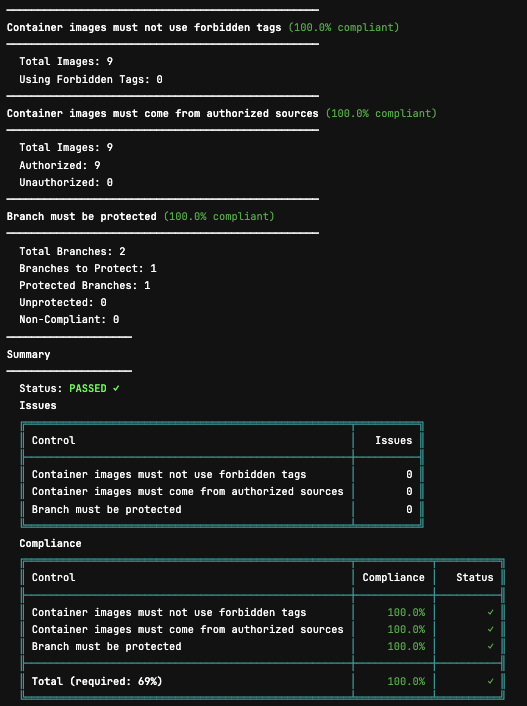

import { Icon } from "astro-icon/components";

The Plumber GitLab Component lets you add compliance scanning directly to your GitLab CI/CD pipelines with a single line of configuration.

<Button variant="outline" class="!border-base-900 dark:!border-base-100 hover:!border-primary-500/90 dark:hover:!border-primary-100/90" href="https://gitlab.com/getplumber/plumber"><Icon name="tabler/brand-gitlab" class="mr-2" />View on GitLab</Button>

## Quick Start (GitLab.com)

<Aside variant="info">
  These instructions are for projects hosted on **gitlab.com**. For self-hosted GitLab instances, see [Self-Hosted GitLab](#self-hosted-gitlab) below.
</Aside>

<Steps>
1. **Create a GitLab token**

   In GitLab, go to **User Settings → Access Tokens** ([or create one here](https://gitlab.com/-/user_settings/personal_access_tokens)) and create a Personal Access Token with `read_api` + `read_repository` scopes.

2. **Add the token to your project**

   Go to your project's **Settings → CI/CD → Variables** and add the token as `GITLAB_TOKEN` (masked recommended).

   <Aside variant="tip">
     You can also use a project or group access token if you prefer scoped permissions.
   </Aside>

3. **Add to your pipeline**

   Add this to your `.gitlab-ci.yml`:

   ```yaml
   include:
     - component: gitlab.com/getplumber/plumber/plumber@~latest
   ```

4. **Run your pipeline**

   Plumber will now run on every pipeline (default branch, tags, and open merge requests) and report compliance issues.
</Steps>

<Aside variant="tip">
  Everything is customizable — GitLab URL, branch, threshold, and more. See [Customize](#customize) below.
</Aside>

## Self-Hosted GitLab

If you're running a self-hosted GitLab instance, you'll need to host your own copy of the component since `gitlab.com` components can't be accessed from your instance.

<Tabs defaultValue="import">
  <TabsList>
    <TabsTrigger value="import">Import Component (Recommended)</TabsTrigger>
    <TabsTrigger value="manual">Custom Component</TabsTrigger>
  </TabsList>

  <TabsContent value="import">
    <Steps>
    1. **Import the repository to your GitLab instance**

       Go to **New Project → Import project → Repository by URL** and use this URL: `https://gitlab.com/getplumber/plumber.git`. Choose a group and project name (e.g., `infrastructure/plumber`).

    2. **Enable the CI/CD Catalog**

       In your imported project, go to **Settings → General** and make sure the project has a **description** (required for CI/CD Catalog). Then expand **Visibility, project features, permissions**, toggle **CI/CD Catalog resource** to enabled, and click **Save changes**.

    3. **Create a release**

       Go to **Code → Tags** and click **New tag**. Enter a version number (e.g., `1.0.0`) and click **Create tag**. The pipeline will create a release and publish the component to your instance's CI/CD Catalog.

    4. **Create a GitLab token**

       In the project you want to scan, go to **User Settings → Access Tokens** and create a Personal Access Token with `read_api` + `read_repository` scopes. Then go to the project's **Settings → CI/CD → Variables** and add the token as `GITLAB_TOKEN` (masked recommended).

       <Aside variant="tip">
         You can also use a project or group access token if you prefer scoped permissions.
       </Aside>

    5. **Use the component in your pipelines**

       ```yaml
       include:
         - component: gitlab.example.com/infrastructure/plumber/plumber@1.0.0
       ```

       The format is `<your-gitlab-host>/<project-path>/plumber@<tag>`. Replace with your actual values.
    </Steps>
  </TabsContent>

  <TabsContent value="manual">
    If you prefer to build your own component, use [`templates/plumber.yml`](https://gitlab.com/getplumber/plumber/-/blob/main/templates/plumber.yml) as a starting point.

    See [GitLab's CI/CD component documentation](https://docs.gitlab.com/ee/ci/components/) for more details.
  </TabsContent>
</Tabs>

## Compliance Controls

Plumber scans your GitLab CI/CD configuration and runs the following controls:

| Control | Description |
|---------|-------------|
| **Authorized image tags** | Flags `latest`, `dev`, and other non-reproducible tags for container images used in CI/CD pipelines |
| **Authorized image sources** | Ensures container images used in your CI/CD pipelines come from approved sources |
| **Branch protection** | Verifies that repository branches are properly protected |

<Aside variant="info">
  More controls are coming soon. Check the [GitHub releases](https://github.com/getplumber/plumber/releases) for updates.
</Aside>

## Customize

Override any input to fit your needs:

```yaml
include:
  - component: gitlab.com/getplumber/plumber/plumber@~latest
    inputs:
      # Target (defaults to current project)
      server_url: https://gitlab.example.com # Self-hosted GitLab
      project_path: other-group/other-project # Analyze a different project
      branch: develop # Analyze a specific branch

      # Compliance
      threshold: 80 # Minimum % to pass (default: 100)
      config_file: configs/my-plumber.yaml # Custom config path

      # Output
      output_file: plumber-report.json # Export JSON report
      print_output: true # Print to stdout

      # Job behavior
      stage: test # Run in a different stage
      allow_failure: true # Don't block pipeline on failure
      gitlab_token: $MY_CUSTOM_TOKEN # Different variable name
      verbose: true # Enable debug output
```

### All Inputs

| Input | Default | Description |
|-------|---------|-------------|
| `server_url` | `$CI_SERVER_URL` | GitLab instance URL |
| `project_path` | `$CI_PROJECT_PATH` | Project to analyze |
| `branch` | `$CI_COMMIT_REF_NAME` | Branch to analyze |
| `gitlab_token` | `$GITLAB_TOKEN` | GitLab API token (requires `read_api` + `read_repository` scopes) |
| `threshold` | `100` | Minimum compliance % to pass |
| `config_file` | *(auto-detect)* | Path to config file (relative to repo root). Auto-detects `.plumber.yaml` in repo, falls back to default |
| `output_file` | `plumber-report.json` | Path to write JSON results |
| `print_output` | `true` | Print text output to stdout |
| `stage` | `.pre` | Pipeline stage for the job |
| `image` | `getplumber/plumber:0.1` | Docker image to use |
| `allow_failure` | `false` | Allow job to fail without blocking |
| `verbose` | `false` | Enable debug output for troubleshooting |

## Configuration

Plumber works out of the box with sensible [defaults](https://github.com/getplumber/plumber/blob/main/.plumber.yaml) embedded in the image.

The component automatically detects your configuration using this priority:

1. **`config_file` input set** → Uses your specified path (relative to repo root)
2. **`.plumber.yaml` in repo root** → Uses your repo's config file
3. **No config found** → Uses the [default](https://github.com/getplumber/plumber/blob/main/.plumber.yaml) configuration embedded in the container

### (Optional) Create a Configuration File

**Option A:** If you have the [CLI](/docs/cli) installed (via Homebrew, Mise, or binary):

```bash
plumber generate config
```

This generates a default config file that you can customize.

**Option B:** Create manually based on the [default config](https://github.com/getplumber/plumber/blob/main/.plumber.yaml):

```yaml
version: "1.0"

controls:
  imageMutable:
    enabled: true
    mutableTags:
      - latest
      - dev

  imageUntrusted:
    enabled: true
    trustedUrls:
      - registry.gitlab.com/*
      - $CI_REGISTRY_IMAGE:*

  branchProtection:
    enabled: true
    namePatterns:
      - main
      - release/*
```

<Aside variant="tip">
   See the [full configuration reference](https://github.com/getplumber/plumber/blob/main/.plumber.yaml) for all available options.
</Aside>

## Example Output

<Aside variant="tip">
  The output is color-coded in your CI/CD job logs for easy scanning - green for passing controls, red for failures.
</Aside>



## Troubleshooting

| Issue | Solution |
|-------|----------|
| `GITLAB_TOKEN environment variable is required` | Add `GITLAB_TOKEN` in **Settings → CI/CD → Variables** |
| `401 Unauthorized` | Check that your token has `read_api` + `read_repository` scopes |
| `403 Forbidden` on MR settings | Expected on non-Premium GitLab; continues without that data |
| Component not found | For self-hosted GitLab, you must fork the component to your instance |

<Aside variant="info">
  **Need help?** Open an issue on [GitHub](https://github.com/getplumber/plumber/issues) or join our [Discord](https://discord.gg/932xkSU24f).
</Aside>
