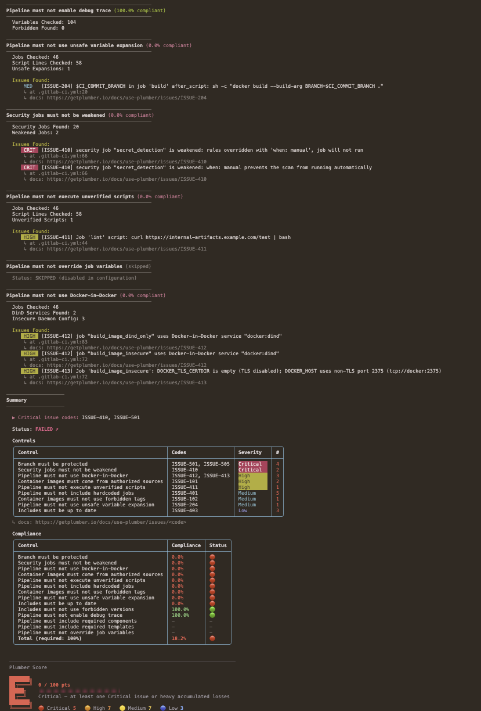
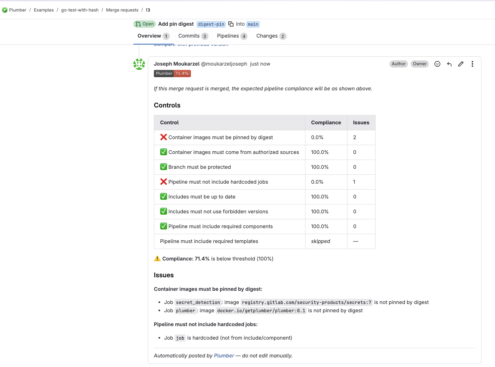
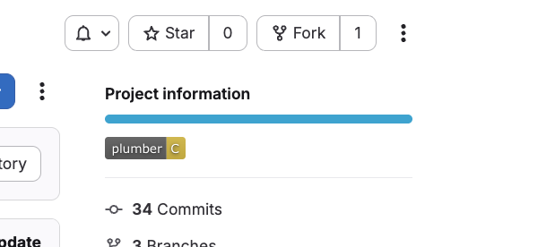

import { Icon } from "astro-icon/components";

Plumber scans your **GitLab CI/CD pipelines** and repository configuration for security problems:

- Unverified remote scripts
- Weakened security jobs
- Missing branch protection
- [More…](/docs/use-plumber/controls?p=gitlab)

It turns them into a [Plumber Score](/docs/plumber-score) from <span class="text-primary-400 dark:text-primary-300 font-bold">A</span> to <span class="font-bold text-red-400 dark:text-red-300">E</span> that can block pipelines below a threshold you set.

## Quick Start

Two ways to scan a GitLab project:

<div class="not-content grid gap-6 sm:grid-cols-2 my-8">
  <a href="#run-locally" class="group block rounded-2xl border bg-card text-card-foreground shadow-sm no-underline transition-colors hover:border-primary/50 focus-visible:outline focus-visible:outline-2 focus-visible:outline-offset-2 focus-visible:outline-primary">
    <div class="flex flex-col space-y-2 p-6">
      <div class="text-xl font-semibold tracking-tight text-card-foreground">
        <Icon name="tabler/terminal-2" size="24px" class="inline align-text-bottom mr-1" /> Run locally
      </div>
      <div class="text-muted-foreground text-sm">Scan one project from your machine: quick checks before you push, security-team audits, or scanning another project without touching its CI.</div>
      <div class="pt-2 text-primary text-sm font-medium group-hover:underline">Local CLI →</div>
    </div>
  </a>

  <a href="#run-with-the-gitlab-ci-component" class="group block rounded-2xl border bg-card text-card-foreground shadow-sm no-underline transition-colors hover:border-primary/50 focus-visible:outline focus-visible:outline-2 focus-visible:outline-offset-2 focus-visible:outline-primary">
    <div class="flex flex-col space-y-2 p-6">
      <div class="text-xl font-semibold tracking-tight text-card-foreground">
        <Icon name="tabler/brand-gitlab" size="24px" class="inline align-text-bottom mr-1" /> Run with the GitLab CI component
      </div>
      <div class="text-muted-foreground text-sm">A drop-in <code>include:</code> that runs on every pipeline (no binary to install) with MR comments, project badges, and a live score badge.</div>
      <div class="pt-2 text-primary text-sm font-medium group-hover:underline">GitLab CI component →</div>
    </div>
  </a>
</div>

## Run locally

<Steps>
1. **Install Plumber**: Homebrew, mise, a prebuilt binary, Docker, or from source (see [Installation](/docs/cli/installation)).

2. **Authenticate**: create a `GITLAB_TOKEN` with `read_api` + `read_repository` scopes (see [Authentication](#authentication)).

3. **Run the scan** from inside your project, or against a remote one (see [Running a scan](#running-a-scan)):

   ```bash
   plumber analyze
   ```

4. **Read your Plumber score**: an A–E grade with a per-control breakdown, plus an optional JSON report, PBOM, and CycloneDX SBOM (see [Example Output](#example-output)).
</Steps>


## Run with the GitLab CI component

<Steps>
1. **Ensure a `.plumber.yaml` exists** in your repo root. Generate one with the [CLI](/docs/cli/installation) if you have it installed, or download the default:

   ```bash
   plumber config generate
   # or:
   curl -fsSL https://raw.githubusercontent.com/getplumber/plumber/main/.plumber.yaml -o .plumber.yaml
   ```

2. **Create a GitLab token**

   Use a token with `read_api` + `read_repository` scopes (or `api` if you enable `mr_comment` / `badge`), as described under [Authentication](#authentication) below.

3. **Add the token to your project**

   Go to **Settings → CI/CD → Variables** and add it as `GITLAB_TOKEN` (masked recommended).

4. **Add the component to your `.gitlab-ci.yml`**

   <Aside variant="info">

   - **Self-hosted GitLab?** You need your own copy of the component; see [Hosting on self-hosted GitLab](#hosting-on-self-hosted-gitlab) below. The snippet below targets gitlab.com.
   - **Why `workflow:rules`?** Without it, pushing to a branch with an open merge request creates **two pipelines** (a branch pipeline and an MR pipeline), splitting your jobs between them. The block below ensures a single pipeline per push: MR pipeline when an MR exists, branch pipeline otherwise. This is the [recommended GitLab pattern](https://docs.gitlab.com/ee/ci/yaml/workflow.html#switch-between-branch-pipelines-and-merge-request-pipelines). If you already have `workflow:rules`, keep yours and just add the `include`.
   - **Publish a live score badge.** Set `score_push: true` to publish a **public** Plumber Score badge for this repo. See [Plumber Score](/docs/plumber-score).

   </Aside>

   ```yaml
   workflow:
     rules:
       - if: $CI_PIPELINE_SOURCE == "merge_request_event"
       - if: $CI_COMMIT_BRANCH && $CI_OPEN_MERGE_REQUESTS # prevents duplicate pipelines
         when: never
       - if: $CI_COMMIT_BRANCH
       - if: $CI_COMMIT_TAG

   include:
     - component: gitlab.com/getplumber/plumber/plumber@<version>
       inputs:
         score_push: false # if "true": publish a public Plumber Score badge
   ```

   Get the latest version from the [CI/CD Catalog](https://gitlab.com/explore/catalog/getplumber/plumber).

5. **Run your pipeline**

   Plumber now runs on every pipeline (default branch, tags, and open merge requests) and reports compliance issues.
</Steps>

### Hosting on self-hosted GitLab

If you run a self-hosted GitLab instance, you need your own copy of the component since `gitlab.com` components can't be accessed from your instance. There are two ways:

<Tabs defaultValue="import">
  <TabsList>
    <TabsTrigger value="import">Direct Import (Simplest)</TabsTrigger>
    <TabsTrigger value="mirror">Fork + Mirror (Recommended)</TabsTrigger>
  </TabsList>

  <TabsContent value="import">
    Import the upstream repository directly into your GitLab instance.

    <Steps>
    1. **Import the repository**

       Go to **New Project → Import project → Repository by URL** and use `https://gitlab.com/getplumber/plumber.git`. Choose a group and project name (e.g., `infrastructure/plumber`).

    2. **Enable the CI/CD Catalog**

       In the imported project, go to **Settings → General**, ensure the project has a **description** (required for the Catalog), expand **Visibility, project features, permissions**, toggle **CI/CD Catalog resource** on, and save.

    3. **Publish a release**

       The imported project comes with upstream tags. Run a pipeline on an existing tag to trigger the release: **CI/CD → Pipelines → Run pipeline**, select an imported tag (e.g., `v0.2.1`), and click **Run pipeline**. This creates a Catalog release for that tag. (Alternatively, create a tag manually under **Code → Tags → New tag**, though that can conflict when fetching remote tags later.)

    4. **Add the token**

       Create a token as described under [Authentication](#authentication), then add it under the scanned project's **Settings → CI/CD → Variables** as `GITLAB_TOKEN` (masked recommended).

    5. **Use the component**

       ```yaml
       include:
         - component: gitlab.example.com/infrastructure/plumber/plumber@v0.3.9
       ```

       To update: re-import or manually pull upstream changes.
    </Steps>
  </TabsContent>

  <TabsContent value="mirror">
    Fork on gitlab.com, then set up a pull mirror on your self-hosted instance so it stays in sync automatically.

    <Steps>
    1. **Fork on gitlab.com**

       Fork [getplumber/plumber](https://gitlab.com/getplumber/plumber) under your gitlab.com namespace (e.g., `your-org/plumber`).

    2. **Create a mirrored project on your instance**

       **New Project → Import project → Repository by URL** with `https://gitlab.com/your-org/plumber.git`.

    3. **Set up pull mirroring**

       In the project, **Settings → Repository → Mirroring repositories**: add `https://gitlab.com/your-org/plumber.git`, direction **Pull**, plus a gitlab.com token with `read_repository` scope if the fork is private.

       <Aside variant="info">
         Pull mirroring syncs automatically (every 30 minutes on Premium, manual on other tiers). On a new upstream release, sync your gitlab.com fork first, then the mirror picks it up.
       </Aside>

    4. **Enable the CI/CD Catalog**

       **Settings → General**: ensure a project description, then toggle **CI/CD Catalog resource** on and save.

    5. **Publish a release**

       Run a pipeline on an existing imported tag (**CI/CD → Pipelines → Run pipeline**) to create a Catalog release.

    6. **Add the token**

       As under [Authentication](#authentication), then add it as `GITLAB_TOKEN` under the scanned project's **Settings → CI/CD → Variables**.

    7. **Use the component**

       ```yaml
       include:
         - component: gitlab.example.com/infrastructure/plumber/plumber@v0.3.9
       ```
    </Steps>
  </TabsContent>
</Tabs>

### Customizing the component

Override any input to fit your needs:

```yaml
include:
  - component: gitlab.com/getplumber/plumber/plumber@v0.3.9
    inputs:
      # Target (defaults to current project)
      server_url: https://gitlab.example.com   # Self-hosted GitLab
      project_path: other-group/other-project   # Analyze a different project
      branch: develop                            # Analyze a specific branch
      ci_config_path: $CI_CONFIG_PATH            # CI config path (GitLab predefined variable)

      # Compliance
      threshold: 80                              # Minimum % to pass (default: 100)
      config_file: configs/my-plumber.yaml       # Custom config path

      # Output
      output_file: plumber-report.json           # Export JSON report
      pbom_file: plumber-pbom.json               # PBOM artifact
      pbom_cyclonedx_file: plumber-cyclonedx-sbom.json  # CycloneDX SBOM (auto-uploaded as a GitLab report)
      print_output: true

      # Job behavior
      stage: test                                # Run in a different stage
      allow_failure: true                        # Don't block the pipeline on failure
      gitlab_token: $MY_CUSTOM_TOKEN             # Different variable name
      verbose: true

      # Selective execution (mutually exclusive)
      controls: containerImageMustNotUseForbiddenTags,branchMustBeProtected
      # skip_controls: branchMustBeProtected

      # MR feedback (require `api` scope, see GitLab Integration above)
      mr_comment: true
      badge: true
```

The `controls` / `skip_controls` inputs map to the CLI `--controls` / `--skip-controls` flags ([valid names](#selective-control-execution)). `mr_comment` and `badge` are the component equivalents of the CLI `--mr-comment` / `--badge` flags shown under [GitLab Integration](#gitlab-integration).

#### All inputs

| Input | Default | Description |
|-------|---------|-------------|
| `server_url` | `$CI_SERVER_URL` | GitLab instance URL |
| `project_path` | `$CI_PROJECT_PATH` | Project to analyze |
| `branch` | `$CI_COMMIT_REF_NAME` | Branch to analyze |
| `ci_config_path` | `$CI_CONFIG_PATH` | CI configuration file path to analyze. Defaults to the GitLab predefined variable (`.gitlab-ci.yml` unless customized in project settings) |
| `gitlab_token` | `$GITLAB_TOKEN` | GitLab API token (`read_api` + `read_repository`, or `api` if `mr_comment` / `badge` is enabled) |
| `threshold` | `100` | Minimum compliance % to pass |
| `config_file` | *(auto-detect)* | Path to config file (relative to repo root). Auto-detects `.plumber.yaml`, falls back to default |
| `output_file` | `plumber-report.json` | Path to write JSON results |
| `pbom_file` | `plumber-pbom.json` | Path to write the PBOM |
| `pbom_cyclonedx_file` | `plumber-cyclonedx-sbom.json` | Path to write the CycloneDX SBOM (auto-uploaded as a GitLab report) |
| `print_output` | `true` | Print text output to stdout |
| `stage` | `.pre` | Pipeline stage for the job. `.pre` runs before all other stages but requires at least one job in a regular stage. If Plumber is the only job, set this to `test` or another stage |
| `image` | `getplumber/plumber:0.1` | Docker image to use |
| `allow_failure` | `false` | Allow the job to fail without blocking |
| `verbose` | `false` | Enable debug output |
| `mr_comment` | `false` | Post/update a compliance comment on the merge request (requires `api` scope) |
| `badge` | `false` | Create/update a Plumber letter-score badge (requires `api` scope; default branch only) |
| `score` | `false` | Deprecated no-op. The Plumber score is shown by default now; kept so pipelines that already set it do not break. Use `score_point` for the full points breakdown |
| `score_point` | `false` | Add the full points breakdown to stdout and the MR comment (the score banner is shown by default) |
| `score_push` | `false` | Publish this repo's Plumber Score to the hosted badge service ([score.getplumber.io](https://score.getplumber.io)). Uses CI-native OIDC (**no secret**); the component mints the id-token. Publishes on every run; the service keeps only the default branch for the public badge. Warns (never fails) on error. See [Plumber Score](/docs/plumber-score) |
| `score_endpoint` | `https://score.getplumber.io` | Score service base URL. Override **only** for a self-hosted score service; the OIDC audience follows this value so it always matches the target |
| `controls` | - | Run only listed controls (comma-separated). Cannot be used with `skip_controls` |
| `skip_controls` | - | Skip listed controls (comma-separated). Cannot be used with `controls` |
| `fail_warnings` | `false` | Treat configuration warnings (unknown keys) as errors (exit 2) |

#### Component configuration resolution

The component resolves your configuration in priority order:

1. **`config_file` input set** uses your specified path (relative to repo root).
2. **`.plumber.yaml` in repo root** uses your repo's config file.
3. **No config found** uses the [default](https://github.com/getplumber/plumber/blob/main/.plumber.yaml) embedded in the container.

To author one, run `plumber config generate` (see the [CLI Reference](/docs/cli/reference#command-reference)) or create it manually from the [default config](https://github.com/getplumber/plumber/blob/main/.plumber.yaml). The CycloneDX SBOM the component writes is automatically uploaded as a [GitLab CycloneDX report](https://docs.gitlab.com/ci/yaml/artifacts_reports/#artifactsreportscyclonedx).


## Authentication

In GitLab, go to **User Settings → Access Tokens** ([direct link](https://gitlab.com/-/user_settings/personal_access_tokens)) and create a Personal Access Token with `read_api` + `read_repository` scopes. **Project Access Tokens** also work: create one inside your project under **Settings → Access Tokens** with the same scopes and at least **Maintainer** role.

<Aside variant="caution">
  The token must belong to a user (or project bot) with **Maintainer** role (or higher) on the project to access branch protection settings and other project configurations.
</Aside>

```bash
export GITLAB_TOKEN=glpat-xxxx
```

Use `api` scope instead of `read_api` if you plan to enable `--mr-comment` or `--badge` (see [GitLab Integration](#gitlab-integration) below).

### Running a scan

```bash
# Auto-detected from git remote
plumber analyze

# Explicit project
plumber analyze --gitlab-url https://gitlab.com --project mygroup/myproject
```

### Self-Hosted GitLab

```bash
plumber analyze --gitlab-url https://gitlab.example.com --project mygroup/myproject
```

### Custom CI Configuration Path

By default Plumber reads the project's configured CI config path (usually `.gitlab-ci.yml`). Override it when your pipeline file lives elsewhere:

```bash
plumber analyze --ci-config-path .gitlab/ci/main.yml
```

## Examples

### Selective Control Execution

You can run or skip specific controls using their YAML key names from `.plumber.yaml`. This is useful for iterative debugging or targeted CI checks.

```bash
# Only check image tags and branch protection
plumber analyze --controls containerImageMustNotUseForbiddenTags,branchMustBeProtected

# Run everything except branch protection
plumber analyze --skip-controls branchMustBeProtected
```

Controls not selected are reported as **skipped** in the output. The `--controls` and `--skip-controls` flags are mutually exclusive.

### Silent Mode (JSON Only)

```bash
plumber analyze \
  --gitlab-url https://gitlab.com \
  --project mygroup/myproject \
  --config .plumber.yaml \
  --threshold 100 \
  --output results.json \
  --print false
```

### Output

The CLI output is color-coded in your terminal for easy scanning: green for passing controls, red for failures.

<Aside variant="tip">
  When using `--output`, results are saved as JSON for programmatic access and CI/CD integration.
</Aside>



### Configuration

The `gitlab.controls:` section of a schema v2 `.plumber.yaml`:

```yaml
version: "2.0"

gitlab:
  controls:
    containerImageMustNotUseForbiddenTags:
      enabled: true
      tags:
        - latest
        - dev
        - main
      # When true, ALL images must be pinned by digest. Takes precedence
      # over the tags list, so even version tags like alpine:3.19 fail.
      containerImagesMustBePinnedByDigest: false

    containerImageMustComeFromAuthorizedSources:
      enabled: true
      trustDockerHubOfficialImages: true
      trustedUrls:
        - $CI_REGISTRY_IMAGE:*
        - registry.gitlab.com/security-products/*

    branchMustBeProtected:
      enabled: true
      defaultMustBeProtected: true
      namePatterns:
        - main
        - release/*
      allowForcePush: false
      minMergeAccessLevel: 30   # Developer
      minPushAccessLevel: 40    # Maintainer

    pipelineMustNotIncludeHardcodedJobs:
      enabled: true

    externalRefsMustNotCollide:
      enabled: true

    includesMustBeUpToDate:
      enabled: true

    includesMustNotUseForbiddenVersions:
      enabled: true
      forbiddenVersions:
        - latest
        - "~latest"
        - main
        - master
        - HEAD
      defaultBranchIsForbiddenVersion: false

    pipelineMustIncludeComponent:
      enabled: false  # Disabled by default. Enable and configure for your org.
      # Expression syntax (use one, not both):
      # required: components/sast/sast AND components/secret-detection/secret-detection
      # Array syntax (OR of ANDs):
      # requiredGroups:
      #   - ["components/sast/sast", "components/secret-detection/secret-detection"]
      #   - ["your-org/full-security/full-security"]

    pipelineMustIncludeTemplate:
      enabled: false  # Disabled by default. Enable and configure for your org.
      # Expression syntax (use one, not both):
      # required: templates/go/go AND templates/trivy/trivy
      # Array syntax (OR of ANDs):
      # requiredGroups:
      #   - ["templates/go/go", "templates/trivy/trivy"]
      #   - ["templates/full-go-pipeline"]

    # Detect debug trace variables that leak secrets in job logs.
    pipelineMustNotEnableDebugTrace:
      enabled: true
      forbiddenVariables:
        - CI_DEBUG_TRACE
        - CI_DEBUG_SERVICES

    # Detect user-controlled variables in shell re-interpretation contexts
    # (eval, sh -c, etc.). Safe: echo $CI_COMMIT_BRANCH. Dangerous: eval
    # "deploy $CI_COMMIT_BRANCH".
    pipelineMustNotUseUnsafeVariableExpansion:
      enabled: true
      dangerousVariables:
        - CI_MERGE_REQUEST_TITLE
        - CI_MERGE_REQUEST_DESCRIPTION
        - CI_COMMIT_MESSAGE
        - CI_COMMIT_TITLE
        - CI_COMMIT_TAG_MESSAGE
        - CI_COMMIT_REF_NAME
        - CI_COMMIT_REF_SLUG
        - CI_COMMIT_BRANCH
        - CI_MERGE_REQUEST_SOURCE_BRANCH_NAME
        - CI_EXTERNAL_PULL_REQUEST_SOURCE_BRANCH_NAME
      # Regex patterns to allow specific script lines (escape $ as \\$).
      allowedPatterns:
        - "helm.*--set.*\\$CI_"
        - "terraform workspace select.*\\$CI_"
        - "docker build.*--build-arg.*\\$CI_"

    # Detect security scanning jobs that have been silently weakened.
    securityJobsMustNotBeWeakened:
      enabled: true
      securityJobPatterns:
        - "*-sast"
        - "secret_detection"
        - "container_scanning"
        - "*_dependency_scanning"
        - "gemnasium-*"
        - "dast"
        - "dast_*"
        - "license_scanning"
      allowFailureMustBeFalse:
        enabled: false   # opt-in: GitLab templates ship with allow_failure: true
      rulesMustNotBeRedefined:
        enabled: true
      whenMustNotBeManual:
        enabled: true

    # Detect controlled variables overridden in .gitlab-ci.yml.
    pipelineMustNotOverrideJobVariables:
      enabled: true
      variables:
        - SECURE_ANALYZERS_PREFIX
        - SAST_DISABLED
        - SAST_EXCLUDED_PATHS
        - SECRET_DETECTION_DISABLED
        - CONTAINER_SCANNING_DISABLED
        - DAST_DISABLED

    # Detect unverified script downloads and execution (curl|bash, wget|sh).
    pipelineMustNotExecuteUnverifiedScripts:
      enabled: true
      trustedUrls: []
        # - https://internal-artifacts.example.com/*

    # Detect Docker-in-Docker services and insecure daemon configuration.
    pipelineMustNotUseDockerInDocker:
      enabled: true
      detectInsecureDaemon: true
```

<Aside variant="info">
  `pipelineMustIncludeComponent` and `pipelineMustIncludeTemplate` support two syntax options for defining requirements (use one, not both):
  - **Expression syntax** (`required`): A natural boolean expression using `AND`, `OR`, and parentheses. `AND` binds tighter than `OR`.
  - **Array syntax** (`requiredGroups`): A list of groups using "OR of ANDs" logic. Outer array = OR, inner array = AND.
</Aside>

## GitLab Integration

Plumber integrates directly with GitLab to provide visual compliance feedback where your team works.

### Merge Request Comments

Automatically post compliance summaries on merge requests to catch issues before they're merged.

```bash
plumber analyze --mr-comment
```

Or via the GitLab CI component:

```yaml
include:
  - component: gitlab.com/getplumber/plumber/plumber@v0.3.9
    inputs:
      mr_comment: true  # Requires api scope on token
```



**Features:**
- Shows the Plumber letter-score badge (A–E) and a short score line; with `score_point`, adds the full points breakdown
- Lists all controls with individual compliance percentages
- Details specific issues found with job names and image references
- Automatically updates on each pipeline run (no duplicate comments)

<Aside variant="caution">
  **Token requirement:** The `api` scope is required (not `read_api`) to create/update MR comments. The `--mr-comment` flag only works in merge request pipelines (`CI_MERGE_REQUEST_IID` must be set).
</Aside>

### Project Badges

Display a live Plumber letter-score badge on your project's overview page.

```bash
plumber analyze --badge
```

Or via the GitLab CI component:

```yaml
include:
  - component: gitlab.com/getplumber/plumber/plumber@v0.3.9
    inputs:
      badge: true  # Requires api scope on token
```

<div style={{maxWidth: '500px'}}>



</div>

**Features:**
- Shows the Plumber letter score (A–E)
- Colored by grade: **A/B** green, **C** yellow, **D** orange, **E** red
- Only updates on default branch pipelines (not on MRs or feature branches)
- Badge appears in GitLab's "Project information" section

<Aside variant="caution">
  **Token requirement:** The `api` scope is required (not `read_api`) and Maintainer role to manage project badges.
</Aside>

## Reference

The complete, always-current catalogs and command reference:

<div class="not-content grid gap-6 sm:grid-cols-3 my-8">
  <a href="/docs/cli/reference" class="group block rounded-2xl border bg-card text-card-foreground shadow-sm no-underline transition-colors hover:border-primary/50 focus-visible:outline focus-visible:outline-2 focus-visible:outline-offset-2 focus-visible:outline-primary">
    <div class="flex flex-col space-y-2 p-6">
      <div class="text-lg font-semibold tracking-tight text-card-foreground">
        <Icon name="tabler/file-text" size="22px" class="inline align-text-bottom mr-1" /> CLI Reference
      </div>
      <div class="text-muted-foreground text-sm">Every <code>analyze</code> flag, the config commands, exit codes, and the JSON / PBOM / CycloneDX output.</div>
    </div>
  </a>

  <a href="/docs/use-plumber/controls?p=gitlab" class="group block rounded-2xl border bg-card text-card-foreground shadow-sm no-underline transition-colors hover:border-primary/50 focus-visible:outline focus-visible:outline-2 focus-visible:outline-offset-2 focus-visible:outline-primary">
    <div class="flex flex-col space-y-2 p-6">
      <div class="text-lg font-semibold tracking-tight text-card-foreground">
        <Icon name="tabler/list-check" size="22px" class="inline align-text-bottom mr-1" /> Controls
      </div>
      <div class="text-muted-foreground text-sm">The full catalog of GitLab controls and what each one checks.</div>
    </div>
  </a>

  <a href="/docs/use-plumber/issues?p=gitlab" class="group block rounded-2xl border bg-card text-card-foreground shadow-sm no-underline transition-colors hover:border-primary/50 focus-visible:outline focus-visible:outline-2 focus-visible:outline-offset-2 focus-visible:outline-primary">
    <div class="flex flex-col space-y-2 p-6">
      <div class="text-lg font-semibold tracking-tight text-card-foreground">
        <Icon name="tabler/alert-triangle" size="22px" class="inline align-text-bottom mr-1" /> Issues
      </div>
      <div class="text-muted-foreground text-sm">Every <code>ISSUE-XXX</code> with severity, impact, and remediation.</div>
    </div>
  </a>
</div>

## Troubleshooting

| Issue | Solution |
|-------|----------|
| `GITLAB_TOKEN environment variable is required` | Set the `GITLAB_TOKEN` environment variable with a valid GitLab token |
| `401 Unauthorized` | Token needs `read_api` + `read_repository` scopes, from a Maintainer or higher |
| `403 Forbidden` on MR settings | Expected on non-Premium GitLab; continues without that data |
| `403 Forbidden` on MR comment | Token needs `api` scope (not `read_api`) when `--mr-comment` is enabled |
| `403 Forbidden` on badge | Token needs `api` scope (not `read_api`) when `--badge` is enabled |
| `404 Not Found` | Verify the project path and GitLab URL are correct |
| MR comment not posted | `--mr-comment` only works in merge request pipelines (`CI_MERGE_REQUEST_IID` must be set) |
| Badge not created/updated | Token needs `api` scope and Maintainer role (or higher) on the project |
| Configuration file not found | Ensure `--config` points at the real file (use an absolute path in Docker). Create one with `plumber config generate` or `plumber config init` |
| Component not found (self-hosted) | You must import or mirror the component to your instance ([Hosting on self-hosted GitLab](#hosting-on-self-hosted-gitlab)) |
| Plumber component job not running | The component's default stage is `.pre`, which requires at least one other job in a regular stage. Override with `inputs: { stage: test }` |
| Two pipelines on the same push | Add [`workflow:rules`](https://docs.gitlab.com/ee/ci/yaml/workflow.html#switch-between-branch-pipelines-and-merge-request-pipelines) to prevent duplicate branch + MR pipelines (see [Run with the GitLab CI component](#run-with-the-gitlab-ci-component)) |
| Component job skipped on branch | The component runs only on merge request events, the default branch, and tags |
| Score badge not published | `score_push` publishes on every CI run, but the **public badge** only reflects your default branch (the service filters by the OIDC branch claim; MR/tag pipelines publish without touching it). A local run never publishes. The push warns, never fails, when the OIDC id-token is unavailable. See [Plumber Score](/docs/plumber-score) |

<Aside variant="info">
  **Need help?** Open an issue on [GitHub](https://github.com/getplumber/plumber/issues) or join our [Discord](/discord).
</Aside>
