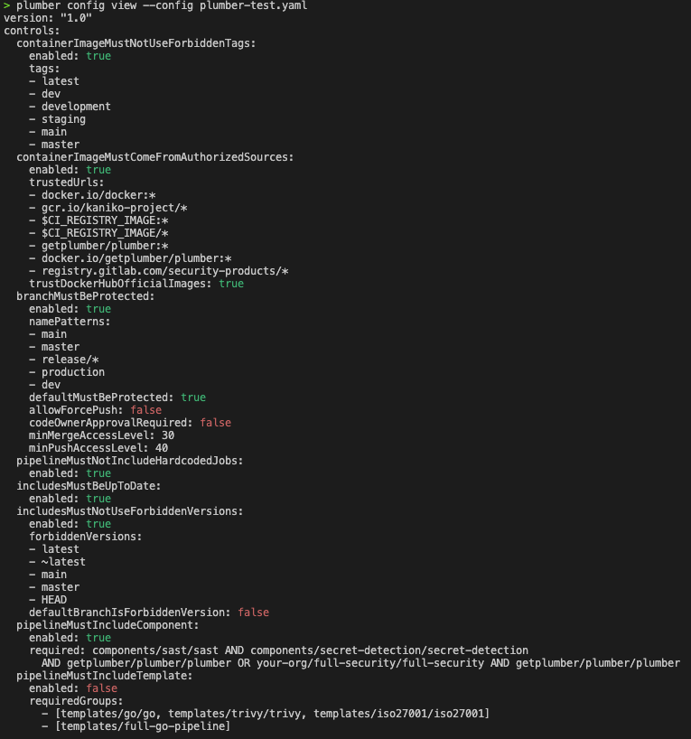

The provider-agnostic reference for the Plumber CLI. The `analyze` command takes provider-specific flags and tokens; the config commands, `plumber explain`, exit codes, and output formats behave identically for both GitLab and GitHub. For installation, see the [Installation](/docs/cli/installation) page. For provider specifics, see the [GitHub](/docs/cli/github) and [GitLab](/docs/cli/gitlab) pages.

## Command Reference

### `plumber analyze`

The main command for analyzing GitLab CI/CD pipelines and GitHub Actions workflows.

```bash
plumber analyze [flags]
```

**Flags**

| Flag | Required | Default | Description |
|------|----------|---------|-------------|
| `--gitlab-url` | No* | auto-detect | GitLab instance URL (e.g., `https://gitlab.com`). Mutually exclusive with `--github-url`. |
| `--github-url` | No* | auto-detect | GitHub host (e.g., `github.com` or `ghes.example.com`). Mutually exclusive with `--gitlab-url`. |
| `--provider` | No | auto-detect | Force the provider: `github` or `gitlab` (overrides auto-detection; the host is still auto-detected). |
| `--project` | No* | auto-detect | Project / repo path. GitLab: `group/project`. GitHub: `owner/repo`. |
| `--config` | No | `.plumber.yaml` | Path to configuration file |
| `--threshold` | No | `100` | Minimum passing % (0-100) |
| `--branch` | No | Project default | Branch to analyze |
| `--print` | No | `true` | Print text output to stdout |
| `--output`, `-o` | No | - | Write JSON results to file |
| `--pbom` | No | - | Write PBOM (Pipeline Bill of Materials) to file |
| `--pbom-cyclonedx` | No | - | Write PBOM in CycloneDX SBOM format |
| `--sarif` | No | - | Write SARIF 2.1.0 results to file (for GitHub Code Scanning / GitLab Security Dashboard) |
| `--glsast` | No | - | Write a GitLab SAST report (`gl-sast-report.json`) for the GitLab Security Dashboard / MR widget |
| `--mr-comment` | No | `false` | Post/update a Plumber comment on the merge request (MR pipelines only; requires `api` scope) |
| `--badge` | No | `false` | Create/update a Plumber badge on the project (requires `api` scope; only runs on default branch) |
| `--score` | No | `false` | Show the Plumber score banner (letter, points, bar, severity counts) on stdout, and include points + score in the JSON, PBOM, and CycloneDX output |
| `--score-point` | No | `false` | Like `--score` plus the full per-issue-code points breakdown in stdout and the MR comment; overrides `--score` when both are set |
| `--score-push` | No | `false` | Publish this repo's Plumber Score to the hosted badge service. Runs in **CI only** (needs a CI-native OIDC id-token; a local run is a no-op). Publishes on every run; the score service keeps only your default branch for the public badge. See [Plumber Score](/docs/plumber-score) |
| `--score-endpoint` | No | `https://score.getplumber.io` | Score service base URL. Override **only** for a self-hosted score service; the minted OIDC audience follows this value so it always matches the target |
| `--controls` | No | - | Run only listed controls (comma-separated). Cannot be used with `--skip-controls` |
| `--skip-controls` | No | - | Skip listed controls (comma-separated). Cannot be used with `--controls` |
| `--fail-warnings` | No | `false` | Fail on warnings: configuration warnings such as unknown keys (exit 2) and "could not verify" warnings such as a skipped known-CVE check (exit 3) |
| `--ci-config-path` | No | auto-detect | Override CI configuration file path. Defaults to project CI config path from GitLab settings (usually `.gitlab-ci.yml`) |
| `--verbose`, `-v` | No | `false` | Enable verbose/debug output |

<Aside variant="info">
  \* Auto-detected from git remote (requires `origin`) if not specified. Supports both SSH and HTTPS remote URLs.
  \* You can always override with `--gitlab-url` / `--github-url` and `--project`
</Aside>

**Environment variables**

| Variable | Required | Description |
|----------|----------|-------------|
| `GITLAB_TOKEN` | GitLab only | GitLab API token with `read_api` + `read_repository` scopes (from a Maintainer or higher). Use `api` scope instead if `--mr-comment` or `--badge` is enabled. |
| `GH_TOKEN` / `GITHUB_TOKEN` | GitHub only | GitHub API token. Fine-grained PAT needs `Contents: Read`, `Metadata: Read`, `Administration: Read`. Classic PAT needs `repo`. Alternatively, run `gh auth login` and Plumber will pick up the gh CLI credential. |
| `PLUMBER_METADATA_TOKEN` | No (GitHub) | Token used only to resolve third-party action versions for the known-CVE check (ISSUE-703). Set it when an action is hosted in an org with an IP allow list that blocks the runner's `GITHUB_TOKEN`; a public-repository read scope is enough. Takes precedence over `GH_TOKEN` for that lookup and carries the higher authenticated rate limit. When unset, Plumber falls back to an anonymous read. |
| `PLUMBER_NO_UPDATE_CHECK` | No | Set to any value (e.g., `1`) to disable the automatic version check. |

### `plumber config init`

Interactive wizard to create a **minimal** `.plumber.yaml`: pick policy areas (container images, pipeline composition, branch protection, variables) and only those controls are written. For each selected area, prompts cover the tunable fields in the schema (lists, booleans, GitLab access levels, `required` expressions for catalog components and file templates, and so on).

**Requires an interactive terminal** (TTY). In CI or Docker without a TTY, use [`plumber config generate`](#plumber-config-generate) instead and edit the file.

**Contrast:** [`plumber config generate`](#plumber-config-generate) always writes the **full** default template **with comments**; `init` writes a **short** file shaped by your answers.

```bash
plumber config init [flags]
```

| Flag | Default | Description |
|------|---------|-------------|
| `--output`, `-o` | `.plumber.yaml` | Output file path |
| `--force`, `-f` | `false` | Overwrite existing file without asking |

**Examples:**

```bash
plumber config init
plumber config init -o configs/plumber.yaml
```

### `plumber config generate`

Writes the **official default** `.plumber.yaml`: the full template Plumber ships with, including comments and every control documented inline. Safe for **scripts and CI** (no prompts). Use [`plumber config init`](#plumber-config-init) when you have a TTY and want a **smaller** file with only the checks you pick.

```bash
plumber config generate [flags]
```

| Flag | Default | Description |
|------|---------|-------------|
| `--output`, `-o` | `.plumber.yaml` | Output file path |
| `--force`, `-f` | `false` | Overwrite existing file |

**Examples:**

```bash
plumber config generate
plumber config generate --output my-plumber.yaml
plumber config generate --force
```

### `plumber config migrate`

Upgrades a `.plumber.yaml` from schema v1 (top-level `controls:`) to schema v2 (per-provider `gitlab.controls:` / `github.controls:`). Comments and YAML anchors are preserved. The migration is idempotent: running it against a file already on v2 is a no-op with a friendly exit message.

By default the tool writes a sibling `.plumber.yaml.v2` so you can diff before swapping. Pass `--in-place` to overwrite the original; the previous file is backed up to `.plumber.yaml.bak`.

```bash
plumber config migrate [flags]
```

| Flag | Default | Description |
|------|---------|-------------|
| `--input` | `.plumber.yaml` | Input config path to read |
| `--output` | `<input>.v2` | Output path. Ignored when `--in-place` is set. |
| `--in-place` | `false` | Overwrite the input file in place. The original is backed up to `<input>.bak`. |

**Examples:**

```bash
# Write a sibling .plumber.yaml.v2; diff before swapping.
plumber config migrate
diff .plumber.yaml .plumber.yaml.v2
mv .plumber.yaml.v2 .plumber.yaml

# Or migrate in place, with backup.
plumber config migrate --in-place
```

<Aside variant="info">
  Plumber still loads v1 files in the current release; the loader auto-converts them in memory and emits a one-line deprecation warning each run. v1 support will be removed in 1.0.0, so migrating is the safe path before that release.
</Aside>

### `plumber config view`

Display a clean, human-readable view of the effective configuration without comments.

```bash
plumber config view [flags]
```

| Flag | Default | Description |
|------|---------|-------------|
| `--config`, `-c` | `.plumber.yaml` | Path to configuration file |
| `--no-color` | `false` | Disable colorized output |

Booleans are colorized for quick scanning: `true` in green, `false` in red. Color is automatically disabled when piping output.

<div style={{maxWidth: '400px'}}>



</div>

**Examples:**

```bash
# View the default .plumber.yaml
plumber config view

# View a specific config file
plumber config view --config custom-plumber.yaml

# View without colors (for piping or scripts)
plumber config view --no-color
```

### `plumber config diff`

Display a clean, human-readable view of the **differences** between the current configuration and the defaults, so you can see exactly what you have changed.

```bash
plumber config diff [flags]
```

| Flag | Default | Description |
|------|---------|-------------|
| `--config`, `-c` | `.plumber.yaml` | Path to configuration file |
| `--no-color` | `false` | Disable colorized output |

**Examples:**

```bash
plumber config diff
plumber config diff --config custom-plumber.yaml
plumber config diff --config custom-plumber.yaml --no-color
```

### `plumber config validate`

Validate a configuration file for correctness. Detects unknown control names and sub-keys with typo suggestions using fuzzy matching.

```bash
plumber config validate [flags]
```

| Flag | Default | Description |
|------|---------|-------------|
| `--config`, `-c` | `.plumber.yaml` | Path to configuration file |
| `--fail-warnings` | `false` | Treat configuration warnings as errors (exit 2) |

Warnings are printed to stderr so they don't interfere with scripted output. Use `--fail-warnings` to exit with code 2 when warnings are found (useful in CI).

**Examples:**

```bash
# Validate the default .plumber.yaml
plumber config validate

# Validate a specific config file
plumber config validate --config custom-plumber.yaml

# Fail on warnings (for CI pipelines)
plumber config validate --fail-warnings
```

**Sample output with typos:**

```
Configuration validation warnings:
  - Unknown control in .plumber.yaml: "containerImageMustNotUseForbiddenTag". Did you mean "containerImageMustNotUseForbiddenTags"?
  - Unknown key "tag" in control "containerImageMustNotUseForbiddenTags". Did you mean "tags"?
  - Unknown key "allowForcePushes" in control "branchMustBeProtected". Did you mean "allowForcePush"?
```

### `plumber explain`

Look up detailed information for an issue code directly from the terminal.

```bash
plumber explain [ISSUE-CODE] [flags]
```

`ISSUE-CODE` supports both full and shorthand forms:
- `ISSUE-412`
- `412`

| Flag | Default | Description |
|------|---------|-------------|
| `--list` | `false` | List all issue codes with short descriptions |
| `--all` | `false` | Show detailed information for all issue codes |
| `--json` | `false` | Output in JSON format |

```bash
plumber explain ISSUE-412
plumber explain 412
plumber explain --list
plumber explain --all
```

**Sample output** (`plumber explain ISSUE-412`):

```
ISSUE-412: Docker-in-Docker service detected
Control:     pipelineMustNotUseDockerInDocker

Description:
  A CI/CD job uses a Docker-in-Docker (dind) service. On shared runners
  running in privileged mode, this enables container escape, lateral
  movement, and access to secrets from other jobs on the same runner.

Remediation:
  Replace Docker-in-Docker with a safer alternative such as Kaniko or
  Buildah for building container images. These tools do not require
  privileged mode and avoid the security risks of running a Docker daemon
  inside a CI container.

Documentation: https://getplumber.io/docs/use-plumber/issues/ISSUE-412
```

## Exit Codes

| Code | Meaning |
|------|---------|
| `0` | Passed (result ≥ threshold) |
| `1` | Threshold failure (result < threshold) |
| `2` | Runtime error (config error, network failure, missing token, etc.) |
| `3` | A check could not be verified and `--fail-warnings` is set (e.g. an action version that could not be resolved) |

## Automatic Version Check

When running locally, Plumber checks GitHub for newer releases on every invocation and prints an upgrade notice if one is available. The check runs asynchronously and has a 3-second timeout, so it never slows down the analysis.

The check is **automatically skipped** when:
- Running in **CI environments** (`CI` or `GITLAB_CI` environment variables are set)
- Using a **development build** (version is `dev`)

To disable it manually:

```bash
export PLUMBER_NO_UPDATE_CHECK=1
```


## Output formats & artifacts

By default Plumber prints a colorized, human-readable report to your terminal (`--print`, on by default). Every machine-readable format below is opt-in: pass the matching flag with a destination path. Formats can be combined in a single run, so one scan can emit JSON, a SARIF report, and an SBOM at once.

| Format | Flag | Spec / shape | What it's for |
|--------|------|--------------|---------------|
| Terminal report | `--print` (default `true`) | Colorized text on stdout | Human-readable summary: per-control results, findings, and the optional [score banner](#plumber-analyze) (`--score` / `--score-point`) |
| JSON report | `--output`, `-o` | Plumber JSON ([structure below](#json-report-structure)) | Full structured result for scripting and CI gates |
| Native PBOM | `--pbom` | Plumber Pipeline Bill of Materials ([below](#pbom--cyclonedx)) | Detailed inventory of pipeline dependencies (images, components, templates, includes) |
| CycloneDX SBOM | `--pbom-cyclonedx` | CycloneDX 1.5 (JSON) | Standard SBOM for security tooling such as Grype, Trivy, and Dependency-Track |
| SARIF | `--sarif` | SARIF 2.1.0 | Findings for GitHub Code Scanning and the GitLab Security Dashboard |
| GitLab SAST report | `--glsast` | GitLab SAST report schema v15.0.4 (`gl-sast-report.json`) | Findings for the GitLab Security Dashboard and the merge-request security widget |

**Outputs that post back to the provider (not files):**

| Output | Flag | Notes |
|--------|------|-------|
| Merge-request comment | `--mr-comment` | Posts/updates a Plumber comment on the GitLab MR. Requires an `api`-scope token; MR pipelines only |
| Project badge | `--badge` | Creates/updates a Plumber badge on the GitLab project. Requires an `api`-scope token; runs on the default branch only |
| Hosted Plumber Score badge | `--score-push` | Publishes this repo's A-E score to the hosted [score service](/docs/plumber-score). CI only (needs a CI-native OIDC id-token); a local run is a no-op |

<Aside variant="info">
  The GitHub Action and GitLab CI component write the JSON report, native PBOM, CycloneDX SBOM, and SARIF by default and upload them as build artifacts. See the [GitHub](/docs/cli/github) and [GitLab](/docs/cli/gitlab) pages.
</Aside>

### PBOM & CycloneDX

`--pbom` writes Plumber's native, pipeline-specific inventory; `--pbom-cyclonedx` writes the same inventory as a [CycloneDX 1.5](https://cyclonedx.org/docs/1.5/json/) SBOM, compatible with tools like Grype, Trivy, and Dependency-Track. With the [GitLab CI component](/docs/cli/gitlab#run-with-the-gitlab-ci-component), the CycloneDX file is automatically uploaded as a [GitLab CycloneDX report](https://docs.gitlab.com/ci/yaml/artifacts_reports/#artifactsreportscyclonedx).

<Aside variant="info">
  CI/CD components and templates do not have CVEs in public vulnerability databases. The PBOM is primarily an **inventory tool**: it tells you *what's in your pipeline*, not whether those items have known vulnerabilities. For image vulnerability scanning, use `trivy image` or `grype` directly on the images.
</Aside>


### JSON report structure

`plumber analyze --output report.json` writes a single JSON object. The keys below are stable for scripting; additional keys may be added in minor versions, existing keys will not be renamed or removed.

**Top-level keys**

| Key | Type | Description |
|-----|------|-------------|
| `projectPath` | string | Path identifying the analyzed project (e.g. `group/project` on GitLab, `owner/repo` on GitHub). |
| `projectId` | number | Provider-side project / repo id, when known. |
| `defaultBranch` | string | Default branch reported by the provider. |
| `analyzeBranch` | string | Branch the analysis actually ran against (`--branch` or the project default). Omitted when it matches `defaultBranch`. |
| `headCommitSha` | string | Head commit SHA of the analyzed branch, used to build stable source links. Omitted when it can't be resolved (e.g. local-only runs). |
| `ciConfigSource` | string | Where the CI configuration came from: `local` (the working tree) or `remote` (fetched from the provider). |
| `ciValid` | boolean | Whether the CI configuration parsed successfully. |
| `ciMissing` | boolean | True when no CI configuration file was found. |
| `ciErrors` | array | CI configuration parse errors reported by the provider. Omitted when none. |
| `pipelineOriginMetrics` | object | Counts and origins of pipeline jobs (hardcoded, from include, from component). |
| `pipelineImageMetrics` | object | Counts of container images per source / registry. |
| `compliance` | number | Effective passing percentage (0–100). |
| `threshold` | number | Threshold from `--threshold` (default 100). |
| `passed` | boolean | True when `compliance >= threshold`. |
| `plumberScore` | object | Scored severity summary (raw points, severity buckets, final points). Present with `--score` / `--score-point`. |
| `<control>Result` | object | One entry per evaluated control (see below). |
| `partialControls` | array | Controls that could not fully evaluate. Empty or omitted on a clean run. |
| `warnings` | array | Non-fatal "could not verify" messages (e.g. a known-CVE check that couldn't resolve an action version). Gated by `--fail-warnings` (exit 3). Omitted when none. |
| `dataCollectionDegraded` | boolean | True when a collection or enrichment step failed mid-run, so the analysis ran on incomplete data. Treat the run as suspect even if `compliance` reads 100. Omitted when false. |
| `degradedReasons` | array | Human-readable reasons behind `dataCollectionDegraded`. Omitted when not degraded. |
| `plumberConfig` | object | Self-describing snapshot of the effective policy: `source`, `effectivePolicy` (the parsed config with comments stripped), and `hash` (sha256 of the canonical policy). Written on every run. |

**Per-control `*Result` block**

Each `*Result` block has the same baseline shape. Some controls add a few control-specific keys on top.

| Key | Type | Description |
|-----|------|-------------|
| `issues` | array | Findings raised by the control. Each entry carries an `ISSUE-XXX` code, severity, location, and message. |
| `metrics` | object | Counts the control collected (jobs scanned, images checked, branches inspected, etc.). |
| `compliance` | number | Per-control passing percentage. |
| `skipped` | boolean | True when the control was disabled in `.plumber.yaml` or excluded via `--skip-controls`. |
| `ciValid` | boolean | Same as the top-level field, scoped to what this control needed. |
| `ciMissing` | boolean | Same as the top-level field, scoped to what this control needed. |
| `version` | string | Schema version of the control's output block. |

**`partialControls` entry**

When non-empty, each entry has the shape shown in the [GitHub authentication section](/docs/cli/github#authentication): `control`, `reason`, `affectedBranches` (when relevant), `remediation`. CI gates should fail loud when this array contains anything, even if `compliance` reads 100.

<Aside variant="info">
  Stability: keys documented above are stable across 0.3.x minor versions. New keys may be added without notice. Existing keys will not be renamed or removed without a major-version bump.
</Aside>
