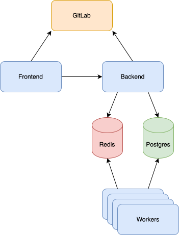

This section describes how to setup your self-managed instance of Plumber.

## Secure Your CI/CD Pipelines

**CI/CD pipelines are the backbone of your software supply chain, and
ensuring their security is a challenging and time-consuming
task. Plumber automates this process for you.**

- Your CI/CD mapped and fully monitored
- 90% less manual effort to keep CI/CD secure
- Always audit-ready

## Quick Installation Guide

  

    

      
🐳 Docker Compose (recommended)

      
Production-ready deployment with automatic Let's Encrypt or custom certificates.

      

        <a href="/docs/installation/docker-compose" class="text-primary hover:underline text-sm font-medium">Learn more →</a>
      

    

  

  

    

      
⏱️ Docker Compose Local

      
Quick local setup for testing and development on your computer.

      

        <a href="/docs/installation/docker-compose-local" class="text-primary hover:underline text-sm font-medium">Learn more →</a>
      

    

  

  

    

      
🚀 Kubernetes

      
Enterprise-grade deployment on Kubernetes using Helm charts.

      

        <a href="/docs/installation/kubernetes" class="text-primary hover:underline text-sm font-medium">Learn more →</a>
      

    

  

  

    

      
🕸 Podman

      
Community-supported deployment using Podman containers (production and local).

      

        <a href="/docs/installation/podman" class="text-primary hover:underline text-sm font-medium">Learn more →</a>
      

    

  

## Installation methods

- [🐳 Docker Compose](/docs/installation/docker-compose) (recommended)
- [🐳 Docker Compose Local](/docs/installation/docker-compose-local) (for testing on your computer)
- [🚀 Kubernetes with Helm](/docs/installation/kubernetes)
- [🕸 Podman](/docs/installation/podman) (community-supported)

## Infrastructure

The Plumber Infrastructure is composed of the following components:

- **Plumber frontend**: the Plumber interface
- **Plumber backend**: the Plumber backend and API
- **Plumber worker**: used to run the tasks of asynchronous requests
- **[PostgreSQL](https://github.com/postgres/postgres)**: used to store Plumber backend data
- **[Redis](https://github.com/redis/redis)**: used to cache Plumber data and create tasks lists for workers
