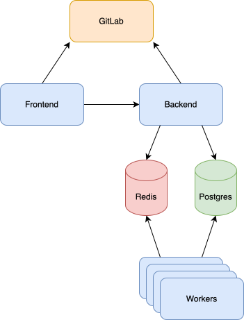

The Plumber Infrastructure is composed of the following components:

- **Plumber frontend**: the Plumber interface
- **Plumber backend**: the Plumber backend and API
- **Plumber worker**: used to run the tasks of asynchronous requests
- **[PostgreSQL](https://github.com/postgres/postgres)**: used to store Plumber backend data
- **[Redis](https://github.com/redis/redis)**: used to cache Plumber data and create tasks lists for workers

